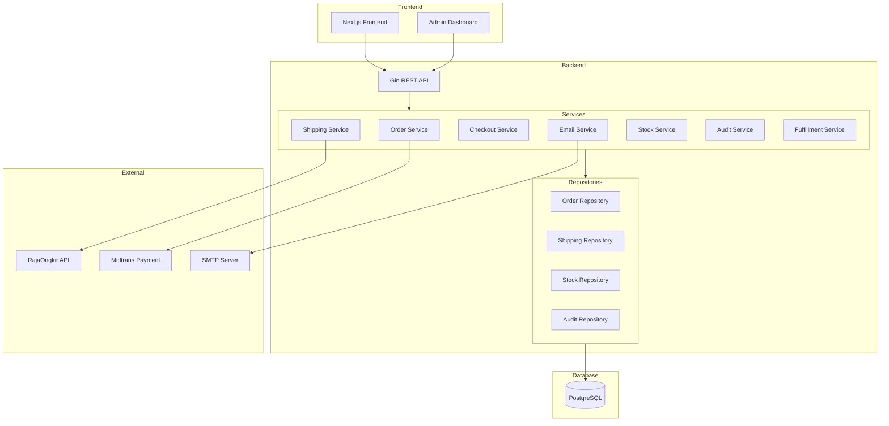
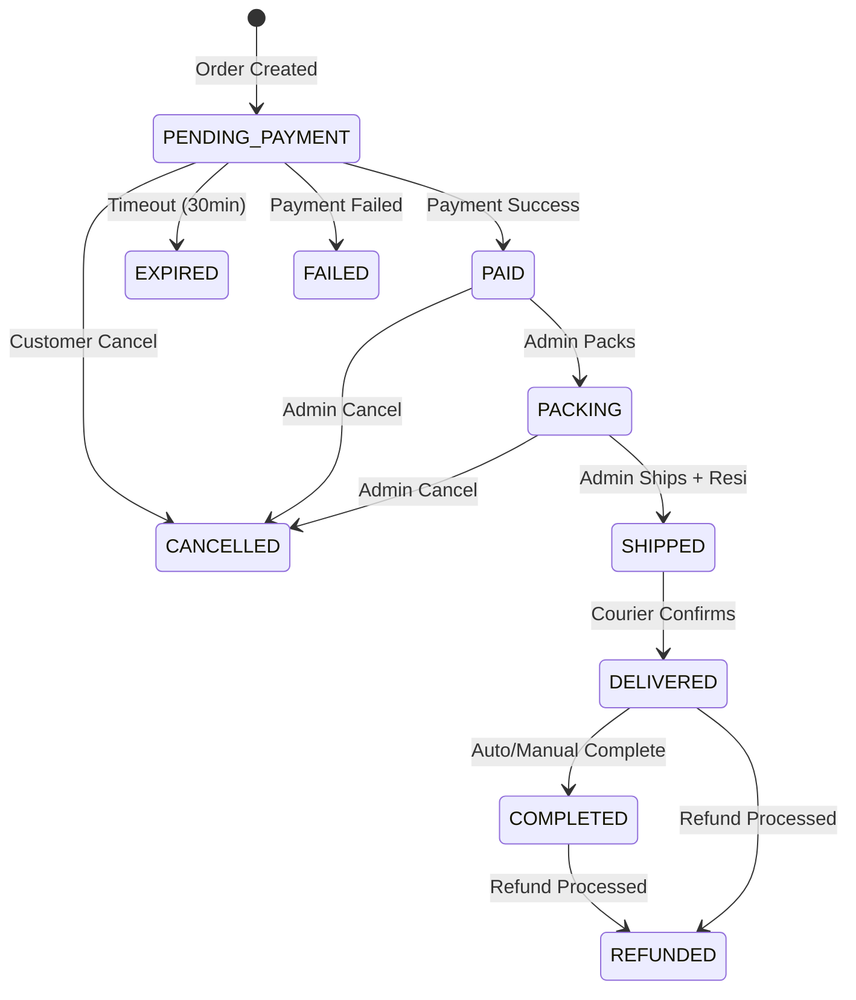

# Design Document: ZAVERA Commerce Platform Upgrade

## Overview

This design document outlines the architecture and implementation details for upgrading ZAVERA from a basic checkout website into a production-grade e-commerce platform. The upgrade focuses on 11 key areas: order lifecycle state machine, RajaOngkir shipping integration, manual resi generation, transactional email system, admin fulfillment panel, stock locking, cancel/refund operations, audit logging, data consistency validation, dashboard metrics, and eliminating fake data.

### Current State Analysis

The existing ZAVERA system already has:
- ✅ Order state machine with transitions (models/models.go)
- ✅ Stock reservation during checkout (repository/order_repository.go)
- ✅ Shipment tracking system (models/shipping.go)
- ✅ Admin audit logging (models/admin_audit.go)
- ✅ Refund system (models/refund.go)
- ✅ RajaOngkir/Kommerce integration (service/kommerce_client.go)
- ✅ Shipping snapshot storage (checkout_service.go)
- ⚠️ Missing: PACKING status in order lifecycle
- ⚠️ Missing: Manual resi generator with ZVR format
- ⚠️ Missing: Transactional email system
- ⚠️ Missing: Stock movement logging table
- ⚠️ Missing: Delivered timestamp on orders
- ⚠️ Missing: Complete admin fulfillment panel actions

## Architecture

### System Architecture Diagram



### Order State Machine



## Components and Interfaces

### 1. Order Service Enhancement

```go
// OrderStatus constants - Updated
const (
    OrderStatusPending    OrderStatus = "PENDING"      // Waiting for payment
    OrderStatusPaid       OrderStatus = "PAID"         // Payment confirmed
    OrderStatusPacking    OrderStatus = "PACKING"      // Being packed (NEW)
    OrderStatusShipped    OrderStatus = "SHIPPED"      // Handed to courier
    OrderStatusDelivered  OrderStatus = "DELIVERED"    // Delivered to customer
    OrderStatusCompleted  OrderStatus = "COMPLETED"    // Order complete
    OrderStatusCancelled  OrderStatus = "CANCELLED"    // Cancelled
    OrderStatusFailed     OrderStatus = "FAILED"       // Payment failed
    OrderStatusExpired    OrderStatus = "EXPIRED"      // Payment expired
    OrderStatusRefunded   OrderStatus = "REFUNDED"     // Refunded (NEW)
)

// ValidOrderTransitions - Updated with PACKING and REFUNDED
var ValidOrderTransitions = map[OrderStatus][]OrderStatus{
    OrderStatusPending: {OrderStatusPaid, OrderStatusCancelled, OrderStatusFailed, OrderStatusExpired},
    OrderStatusPaid: {OrderStatusPacking, OrderStatusCancelled},
    OrderStatusPacking: {OrderStatusShipped, OrderStatusCancelled},
    OrderStatusShipped: {OrderStatusDelivered},
    OrderStatusDelivered: {OrderStatusCompleted, OrderStatusRefunded},
    OrderStatusCompleted: {OrderStatusRefunded},
}
```

### 2. Resi Generator Service

```go
// ResiService generates unique airway bill numbers
type ResiService interface {
    GenerateResi(orderID int, courierCode string) (string, error)
    ValidateResi(resi string) bool
    IsResiLocked(orderID int) bool
}

// Resi format: ZVR-{COURIER}-{YYYYMMDD}-{ORDERID}-{RANDOM4}
// Example: ZVR-JNE-20260111-98312-A7KD
```

### 3. Email Service Interface

```go
type EmailService interface {
    SendOrderCreated(order *Order, items []OrderItem) error
    SendPaymentSuccess(order *Order) error
    SendOrderShipped(order *Order, shipment *Shipment) error
    SendOrderDelivered(order *Order) error
}

type EmailTemplate struct {
    Subject     string
    HTMLBody    string
    PlainBody   string
}
```

### 4. Stock Movement Service

```go
type StockMovementType string

const (
    StockMovementReserve StockMovementType = "RESERVE"
    StockMovementRelease StockMovementType = "RELEASE"
    StockMovementDeduct  StockMovementType = "DEDUCT"
)

type StockMovement struct {
    ID        int
    ProductID int
    OrderID   int
    Type      StockMovementType
    Quantity  int
    CreatedAt time.Time
}

type StockService interface {
    ReserveStock(orderID int, items []OrderItem) error
    ReleaseStock(orderID int) error
    DeductStock(orderID int) error
    GetMovements(productID int) ([]StockMovement, error)
}
```

### 5. Admin Fulfillment Service Enhancement

```go
type FulfillmentService interface {
    // Existing methods...
    
    // New methods for fulfillment panel
    PackOrder(orderCode string, adminEmail string) error
    ShipOrder(orderCode string, adminEmail string) (*Shipment, error)
    GenerateAndAssignResi(orderID int, courierCode string) (string, error)
    
    // Dashboard metrics
    GetDashboardMetrics() (*DashboardMetrics, error)
}

type DashboardMetrics struct {
    TotalRevenue      float64
    OrdersToday       int
    OrdersShipped     int
    OrdersPending     int
    LowStockProducts  []Product
}
```

## Data Models

### New/Updated Database Tables

#### 1. stock_movements Table (NEW)
```sql
CREATE TABLE stock_movements (
    id SERIAL PRIMARY KEY,
    product_id INTEGER NOT NULL REFERENCES products(id),
    order_id INTEGER REFERENCES orders(id),
    type VARCHAR(20) NOT NULL, -- RESERVE, RELEASE, DEDUCT
    quantity INTEGER NOT NULL,
    balance_after INTEGER NOT NULL,
    created_at TIMESTAMP DEFAULT CURRENT_TIMESTAMP,
    
    CONSTRAINT chk_movement_type CHECK (type IN ('RESERVE', 'RELEASE', 'DEDUCT'))
);
```

#### 2. shipping_snapshots Table (NEW)
```sql
CREATE TABLE shipping_snapshots (
    id SERIAL PRIMARY KEY,
    order_id INTEGER NOT NULL REFERENCES orders(id) UNIQUE,
    courier VARCHAR(50) NOT NULL,
    service VARCHAR(50) NOT NULL,
    cost DECIMAL(12, 2) NOT NULL,
    etd VARCHAR(50) NOT NULL,
    origin_city_id VARCHAR(20) NOT NULL,
    destination_city_id VARCHAR(20) NOT NULL,
    weight INTEGER NOT NULL,
    rajaongkir_raw_json JSONB NOT NULL,
    created_at TIMESTAMP DEFAULT CURRENT_TIMESTAMP
);
```

#### 3. Orders Table Updates
```sql
ALTER TABLE orders ADD COLUMN IF NOT EXISTS resi VARCHAR(100);
ALTER TABLE orders ADD COLUMN IF NOT EXISTS delivered_at TIMESTAMP;
ALTER TABLE orders ADD COLUMN IF NOT EXISTS origin_city VARCHAR(100) DEFAULT 'Semarang';
ALTER TABLE orders ADD COLUMN IF NOT EXISTS destination_city VARCHAR(100);

-- Update order_status enum to include PACKING and REFUNDED
ALTER TYPE order_status ADD VALUE IF NOT EXISTS 'PACKING' AFTER 'PAID';
ALTER TYPE order_status ADD VALUE IF NOT EXISTS 'REFUNDED' AFTER 'COMPLETED';
```

#### 4. Email Templates Table (NEW)
```sql
CREATE TABLE email_templates (
    id SERIAL PRIMARY KEY,
    template_key VARCHAR(50) UNIQUE NOT NULL,
    subject_template TEXT NOT NULL,
    html_template TEXT NOT NULL,
    is_active BOOLEAN DEFAULT true,
    created_at TIMESTAMP DEFAULT CURRENT_TIMESTAMP,
    updated_at TIMESTAMP DEFAULT CURRENT_TIMESTAMP
);
```

#### 5. Email Logs Table (NEW)
```sql
CREATE TABLE email_logs (
    id SERIAL PRIMARY KEY,
    order_id INTEGER REFERENCES orders(id),
    template_key VARCHAR(50) NOT NULL,
    recipient_email VARCHAR(255) NOT NULL,
    subject VARCHAR(500) NOT NULL,
    status VARCHAR(20) NOT NULL, -- SENT, FAILED, PENDING
    error_message TEXT,
    sent_at TIMESTAMP,
    created_at TIMESTAMP DEFAULT CURRENT_TIMESTAMP
);
```


## Correctness Properties

*A property is a characteristic or behavior that should hold true across all valid executions of a system-essentially, a formal statement about what the system should do. Properties serve as the bridge between human-readable specifications and machine-verifiable correctness guarantees.*

### Property 1: Order State Machine Validity
*For any* order and any attempted status transition, the transition SHALL succeed if and only if it follows the defined state machine (PENDING→PAID→PACKING→SHIPPED→DELIVERED→COMPLETED, with CANCELLED/REFUNDED as terminal states from allowed positions).
**Validates: Requirements 1.2, 1.3**

### Property 2: Order Initial Status
*For any* newly created order, the initial status SHALL be PENDING_PAYMENT (PENDING).
**Validates: Requirements 1.1**

### Property 3: Status Change Audit Logging
*For any* order status change, an audit log entry SHALL be created containing the order ID, previous status, new status, actor, and timestamp.
**Validates: Requirements 1.4, 8.1**

### Property 4: Order Data Persistence
*For any* order creation request with valid data, the order SHALL be stored with all required fields: user_id, status, subtotal, shipping_cost, total, courier, service, origin_city, destination_city, and weight.
**Validates: Requirements 1.5**

### Property 5: Shipping Rate Calculation Parameters
*For any* shipping rate request, the system SHALL query the shipping API with origin (Semarang district ID), destination (user district ID), and weight (sum of product weights × quantities).
**Validates: Requirements 2.1**

### Property 6: Shipping Response Parsing
*For any* valid shipping API response, the parsed result SHALL contain courier name, service type, price, and ETA for each option.
**Validates: Requirements 2.2**

### Property 7: Shipping Snapshot Storage
*For any* shipping option selection, a shipping_snapshot record SHALL be created containing order_id, courier, service, cost, etd, and rajaongkir_raw_json.
**Validates: Requirements 2.3**

### Property 8: Shipping Data Integrity
*For any* order with shipping, the displayed shipping cost and ETA SHALL exactly match the values stored in the shipping snapshot (which came from RajaOngkir API).
**Validates: Requirements 2.4, 2.5, 11.1, 11.2**

### Property 9: Resi Format and Uniqueness
*For any* generated resi, the format SHALL match ZVR-{COURIER}-{YYYYMMDD}-{ORDERID}-{RANDOM4} and SHALL be unique across all orders.
**Validates: Requirements 3.1, 3.2, 3.4**

### Property 10: Resi Immutability After Shipping
*For any* order with status SHIPPED or beyond, any attempt to modify the resi field SHALL fail.
**Validates: Requirements 3.3**

### Property 11: Email Content Completeness
*For any* transactional email (order created, payment success, shipped, delivered), the email SHALL be in HTML format and contain the required information for that email type.
**Validates: Requirements 4.1, 4.2, 4.3, 4.4, 4.5**

### Property 12: Admin Pack Action
*For any* PAID order, when an admin executes the "Pack" action, the order status SHALL change to PACKING and an audit log SHALL be created.
**Validates: Requirements 5.3**

### Property 13: Admin Ship Action
*For any* PACKING order, when an admin executes the "Ship" action, a resi SHALL be generated, status SHALL change to SHIPPED, and a shipping email SHALL be triggered.
**Validates: Requirements 5.4**

### Property 14: Cancel Permission Validation
*For any* cancellation request, customer cancellation SHALL succeed only if status is PENDING_PAYMENT, and admin cancellation SHALL succeed only if status is before SHIPPED.
**Validates: Requirements 5.6, 7.1, 7.2**

### Property 15: Stock Reservation on Checkout
*For any* checkout initiation, the requested quantity for each product SHALL be reserved (decremented from available stock).
**Validates: Requirements 6.1**

### Property 16: Stock Release on Failure
*For any* order that fails payment, expires, or is cancelled, the reserved stock SHALL be released (restored to available inventory).
**Validates: Requirements 6.2, 6.3, 7.3**

### Property 17: Stock Movement Logging
*For any* stock operation (reserve, release, deduct), a stock_movements record SHALL be created with product_id, order_id, type, quantity, and timestamp.
**Validates: Requirements 6.5**

### Property 18: Refund Processing
*For any* refund request on an eligible order, the system SHALL log the reason, restore stock if applicable, and update order status to REFUNDED.
**Validates: Requirements 7.4**

### Property 19: Audit Log Immutability
*For any* audit log entry, UPDATE and DELETE operations SHALL fail (append-only).
**Validates: Requirements 8.2**

### Property 20: Server-Side Total Calculation
*For any* order, the total_amount SHALL equal subtotal + shipping_cost + tax - discount, calculated server-side regardless of frontend-submitted values.
**Validates: Requirements 9.1, 9.3, 11.3**

### Property 21: Dashboard Metrics Accuracy
*For any* dashboard query, the revenue metric SHALL equal the sum of total_amount for PAID/COMPLETED orders, and order counts SHALL match actual database counts by status.
**Validates: Requirements 10.1, 10.2, 10.3**

## Error Handling

### Order State Machine Errors
- Invalid transition attempts return `ErrInvalidTransition` with current and attempted status
- Final state modification attempts return `ErrOrderAlreadyFinal`
- Non-existent order returns `ErrOrderNotFound`

### Stock Errors
- Insufficient stock returns `ErrInsufficientStock` with product name and available quantity
- Stock already released (idempotency) returns success without action

### Shipping Errors
- RajaOngkir API failure returns `ErrShippingNotAvailable`
- Invalid courier/service returns `ErrInvalidCourier`
- Missing district ID returns `ErrInvalidAddress`

### Resi Errors
- Duplicate resi (should never happen) triggers retry with new random suffix
- Resi modification on shipped order returns `ErrResiLocked`

### Email Errors
- SMTP failure logs error and queues for retry
- Invalid email address returns `ErrInvalidEmail`

## Testing Strategy

### Dual Testing Approach

This implementation uses both unit tests and property-based tests:

1. **Unit Tests**: Verify specific examples, edge cases, and integration points
2. **Property-Based Tests**: Verify universal properties hold across all valid inputs

### Property-Based Testing Framework

**Framework**: [gopter](https://github.com/leanovate/gopter) for Go property-based testing

**Configuration**: Each property test runs minimum 100 iterations

### Test Categories

#### 1. Order State Machine Tests
- Property tests for valid/invalid transitions
- Unit tests for specific transition scenarios
- Edge case tests for terminal states

#### 2. Stock Management Tests
- Property tests for reservation/release/deduct operations
- Unit tests for concurrent stock operations
- Edge case tests for zero stock, negative quantities

#### 3. Resi Generation Tests
- Property tests for format validation
- Property tests for uniqueness
- Unit tests for immutability after shipping

#### 4. Shipping Integration Tests
- Property tests for parameter calculation
- Unit tests for API response parsing
- Mock tests for API failure scenarios

#### 5. Email System Tests
- Property tests for content completeness
- Unit tests for HTML template rendering
- Mock tests for SMTP failures

#### 6. Audit Log Tests
- Property tests for log creation on changes
- Property tests for immutability
- Unit tests for query functionality

### Test Annotations

Each property-based test MUST include:
```go
// **Feature: zavera-commerce-upgrade, Property {number}: {property_text}**
// **Validates: Requirements X.Y**
```
